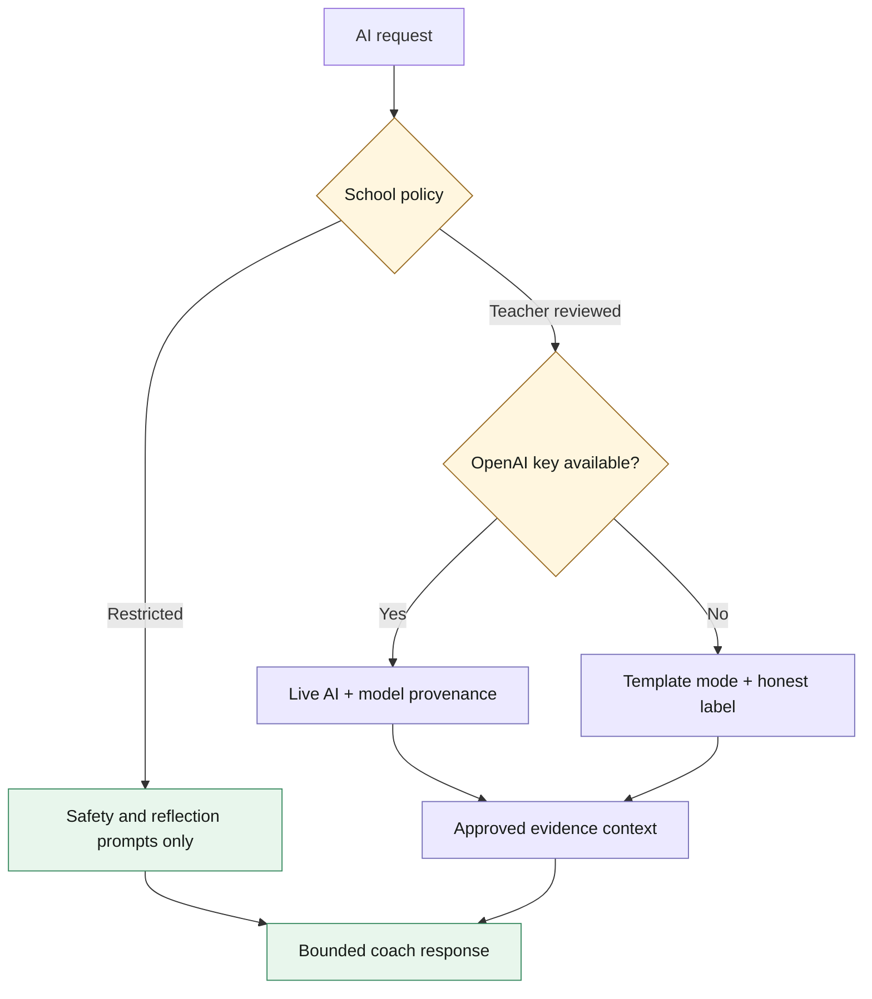
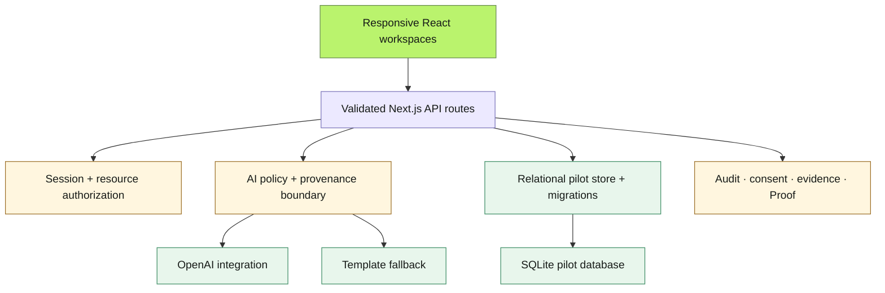

# Pluto

<div align="center">

### Real problems. Guided learning. Proof that lasts.

<sub>Teacher-controlled AI for community-connected learning</sub>

`EDUCATION` &nbsp; `AI WITH GUARDRAILS` &nbsp; `NEXT.JS` &nbsp; `OPEN SOURCE PILOT`

</div>

---

Pluto is a teacher-controlled learning workspace that connects schools with local community organisations.

A partner brings a real challenge. Pluto shapes it into a safe learning mission. A teacher reviews the scope and safeguards, proposes balanced student teams, and controls every release. Students research, collaborate, create useful work, and document their contribution. The partner validates the outcome. Pluto brings the mission, evidence, assessment, consent, and community response together in a shareable **Pluto Proof** record.

> **Project status** — Pluto is an open pilot foundation for demos, judging, and continued development. It is not approved for real student data or school-wide production use.

<p align="center">
  <strong>Community challenge</strong>
  &nbsp;→&nbsp;
  <strong>Teacher-approved mission</strong>
  &nbsp;→&nbsp;
  <strong>Evidence-backed student work</strong>
  &nbsp;→&nbsp;
  <strong>Pluto Proof</strong>
</p>

## Contents

| | | |
| --- | --- | --- |
| [Why Pluto](#why-pluto-exists) | [Product flow](#the-product-flow) | [AI contract](#honest-ai-by-design) |
| [Assignment engine](#assignment-engine) | [Architecture](#technical-architecture) | [Run locally](#run-pluto-locally) |
| [Build Week](#openai-build-week) | [Production boundary](#production-boundary) | [Contributing](#contributing-and-security) |

## Why Pluto exists

Schools want learning to feel useful beyond the classroom. Community organisations have meaningful local problems but rarely have a safe, structured way to work with students. Existing AI tools can generate content quickly, but they do not automatically understand school policy, student identity, evidence quality, or who should be allowed to make a decision.

Pluto is built around a different contract:

- AI can help structure complex work, but it does not silently decide what is true, who is assigned, or how a student is graded.
- Teachers remain responsible for mission approval, student access, assessment, and publication.
- Students see clear next steps, grounded sources, and an honest explanation of what the coach can and cannot do.
- Partners validate usefulness, never individual student grades.

> [!IMPORTANT]
> Pluto is not an AI chatbot placed in front of a classroom. It is a supervised workflow where every important decision has a person, a policy, and an evidence trail.

## The product flow

```mermaid
flowchart LR
    A["Partner shares a local need"] --> B["Pluto drafts a safe mission"]
    B --> C["Teacher reviews and approves"]
    C --> D["Roster import + team proposal"]
    D --> E["Teacher approves assignments"]
    E --> F["Students create and link evidence"]
    F --> G["Teacher assesses contribution"]
    G --> H["Partner validates usefulness"]
    H --> I["Pluto Proof snapshot"]

    classDef human fill:#baf36d,stroke:#64864e,color:#171b18;
    classDef system fill:#ece9ff,stroke:#7770b8,color:#171b18;
    classDef proof fill:#1a211a,stroke:#baf36d,color:#ffffff;
    class A,C,E,G,H human;
    class B,D,F system;
    class I proof;
```



| Stage | Owner | Decision |
| --- | --- | --- |
| Challenge | Community partner | What local problem is worth solving? |
| Mission | Pluto + teacher | Is the work safe, useful, and teachable? |
| Assignment | Teacher | Which students and roles are appropriate? |
| Evidence | Student + teacher | What supports the claim and contribution? |
| Outcome | Partner | Was the result useful to the community? |

## What is implemented

### Partner workspace

- Challenge intake by text or voice note
- Locality, audience, grade, subject, language, and outcome context
- Mission progress and delivery review
- Partner validation without access to private student assessment

### Teacher workspace

- Mission review with curriculum links, safety controls, sources, milestones, deliverables, and rubric
- Server-gated mission approval before student access
- Roster import with interests, strengths, availability, role preferences, and accommodations
- Balanced, editable team proposals with approval history and undo
- Team monitoring, check-ins, assessment, consent, and publication controls

### Student workspace

- Mission context, role, checkpoint, and next action
- Team workspace, research log, evidence links, artefacts, and comments
- Individual reflection and contribution evidence
- Source-aware coaching with approved evidence only
- Final submission and Proof preview

### School administration

- School-scoped programme overview
- AI policy and Restricted mode controls
- Consent and safeguarding records
- Partner directory and verification
- Impact analytics and gradebook export

## Honest AI by design

Pluto makes the AI state visible instead of presenting every response as if it came from a live model.

| State | Behaviour |
| --- | --- |
| **Live AI** | Uses the configured OpenAI model for mission drafting, bounded coaching, or transcription. |
| **Template mode** | Uses deterministic local structures when no API key is configured or a live response is unavailable. |
| **Restricted policy** | Enforced server-side. The coach is limited to safety and reflection prompts, even if a client requests live generation. |

The coach receives teacher-approved evidence only. When possible, it returns citations to that evidence; when the material is insufficient, it says so. AI mode, policy, model, and evidence provenance are recorded in the audit path.



## Assignment engine

Pluto does not make a black-box student assignment. It creates a proposal that a teacher can inspect and edit.

The proposal considers:

- interests and strengths
- preferred mission roles
- availability and availability windows
- accessibility needs and accommodations
- team size and role coverage
- distribution of strong role matches across teams

The teacher approves the final assignment, and the approval becomes part of the workflow history.

## Pluto Proof

Pluto Proof is a shareable mission record that connects:

- the original community challenge
- the teacher-approved mission
- student contribution and evidence
- source and citation context
- individual assessment and reflection
- consent and publication state
- partner validation

The current pilot creates an immutable-style snapshot for verification. A production release will add stronger cryptographic signing, managed storage, and retention controls.

## Technical architecture

| Layer | Implementation |
| --- | --- |
| Application | Next.js App Router, React, TypeScript |
| UI system | One responsive Pluto design system in `app/pluto-system.css` |
| Validation | Zod contracts at API boundaries |
| AI | OpenAI integration with explicit Live, Template, and Restricted states |
| Storage | Migration-backed relational SQLite pilot store |
| Authorization | Server-side session checks and school/resource-level access rules |
| Evidence | Approved source links, citations, consent, publication state, and audit records |
| Verification | Typecheck, ESLint, Node tests, and production build in GitHub Actions |

### Core boundaries



> [!TIP]
> The diagrams are written in Mermaid inside this README, so they remain editable, versioned, and useful to contributors instead of becoming another unmaintained image asset.

## Repository map

```text
app/                    Next.js routes, pages, API endpoints, and global CSS
components/             Pluto shell, marketing experience, workspaces, and assignment UI
features/missions/      Mission schemas, demo challenge, and generation contracts
features/platform/      Contracts, authorization, relational store, assignments, Proof
db/                     Relational migration support
docs/                   Product, UX, frontend, backend, and delivery specifications
tests/                  Contract and migration tests
public/                 Public application assets
```

## Run Pluto locally

### Requirements

- Node.js `22.5+`
- pnpm `11.7+`

### Install and start

```powershell
pnpm install
pnpm dev
```

Open [http://127.0.0.1:3000](http://127.0.0.1:3000).

The seeded demo uses a Kochi waste-separation mission so every role can be explored without creating real school data.

### Demo accounts

All pilot accounts use the password `pluto-demo`:

| Role | Email |
| --- | --- |
| Community partner | `partner@pluto.local` |
| Teacher | `teacher@pluto.local` |
| Student | `student@pluto.local` |
| School admin | `admin@pluto.local` |

These accounts are for local demonstration only. They are not production authentication and must never be used with real student information.

## Environment variables

Create `.env.local` only when you need live AI or a production-like session:

```env
# Optional: enables live mission drafting, coaching, and transcription.
OPENAI_API_KEY=
OPENAI_MISSION_MODEL=gpt-5.6
OPENAI_MENTOR_MODEL=gpt-5.6
OPENAI_TRANSCRIPTION_MODEL=gpt-4o-mini-transcribe

# Required when NODE_ENV=production.
PLUTO_SESSION_SECRET=

# Optional local path for the pilot SQLite store.
PLUTO_DATA_DIRECTORY=
```

Without `OPENAI_API_KEY`, Pluto remains usable in clearly labelled Template mode.

Generate a session secret locally with:

```powershell
node -e "console.log(require('crypto').randomBytes(32).toString('hex'))"
```

Keep secrets in `.env.local` or your hosting provider. Never commit them to GitHub or place them in screenshots.

## Verification

Run the same checks used by the project workflow before opening a pull request:

```powershell
pnpm typecheck
pnpm lint
pnpm test
pnpm build
```

## Vercel deployment

1. Import the GitHub repository into Vercel.
2. Add `PLUTO_SESSION_SECRET` under **Settings → Environment Variables** for Production and Preview.
3. Redeploy after saving the variable.
4. Check `/api/health` on the deployed domain.

The Vercel demo uses its writable `/tmp` directory for the pilot SQLite store. This keeps the demo functional, but data can reset when a serverless instance is recycled. Use a hosted relational database and object store before treating Pluto as a durable production system.

## API surface

| Capability | Main routes |
| --- | --- |
| Mission and AI | `/api/missions/generate`, `/api/coach`, `/api/challenges/transcribe` |
| Identity and programme | `/api/platform/session`, `/api/platform/program`, `/api/platform/audits` |
| Roster and assignment | `/api/platform/roster`, `/api/platform/assignments` |
| Evidence and collaboration | `/api/platform/research/check`, `/api/platform/files`, `/api/platform/comments` |
| Assessment and governance | `/api/platform/assessment`, `/api/platform/consents`, `/api/platform/notifications` |
| Proof and exports | `/api/platform/proof/verify/:id`, `/proof/:id`, `/api/platform/exports/grades` |

## OpenAI Build Week

Pluto is submitted to the **Education** category for [OpenAI Build Week](https://openai.devpost.com/).

The submission story focuses on four judging dimensions:

1. **Technological implementation** — a working multi-role product with server-side policy, authorization, assignment constraints, evidence handling, and migrations.
2. **Design** — a coherent product experience that uses large visual context for mission overviews and compact task-first surfaces for real work.
3. **Potential impact** — a specific workflow for schools, teachers, students, and local organisations.
4. **Quality of the idea** — accountable AI that supports learning without replacing teacher judgement.

Codex was used throughout the build to consolidate the product, implement the assignment and evidence workflows, refine API contracts, fix deployment issues, improve the design system, and verify the project. GPT-5.6 powers the live AI path when configured; Template and Restricted modes keep the experience honest when live generation is unavailable or not allowed.

## Production boundary

Before real school use, Pluto still needs:

- managed identity, SSO, and school directory integration
- managed relational storage and object storage
- explicit retention, deletion, export, and backup controls
- malware scanning and secure file processing
- production monitoring, alerting, and background workers
- independent accessibility and localisation validation
- LMS/SIS integrations and operational support processes

The current pilot is intentionally transparent about this boundary.

## Documentation

The [`docs/`](docs/README.md) directory is the product source of truth:

1. [Product brief](docs/00-product-brief.md)
2. [Experience and UI specification](docs/01-ux-ui-spec.md)
3. [Frontend architecture](docs/02-frontend-architecture.md)
4. [Backend and AI architecture](docs/03-backend-ai-architecture.md)
5. [Delivery plan](docs/05-delivery-plan.md)

## Contributing and security

Read [CONTRIBUTING.md](CONTRIBUTING.md) before opening a pull request. Read [SECURITY.md](SECURITY.md) before handling any sensitive data or reporting a vulnerability.

Please do not upload real student records, private school information, or sensitive partner data to this pilot repository.

## License

Pluto is released under the [MIT License](LICENSE).
